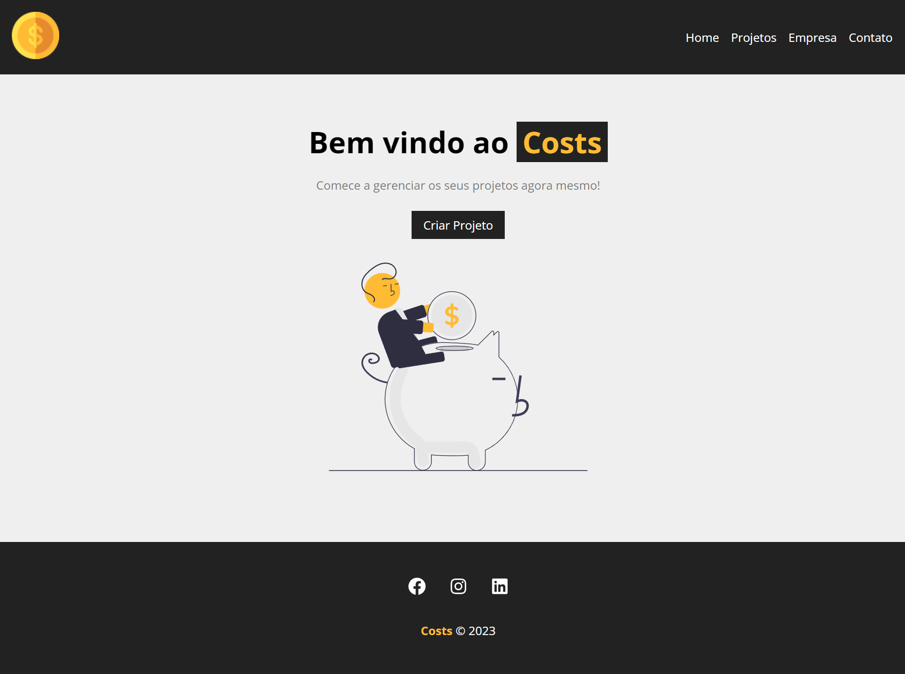

# Costs 2023
 
 <H1>Gerenciador de Projetos</H1>
 
 
 

 Projeto construido a partir do curso de React do <a target="_blank" href="https://www.youtube.com/@MatheusBattisti">Matheus Battisti</a>.

<dl>
 <dt><h2>Tecnologias:</h2></dt> 
  <dd> HTML5</dd>
  <dd> CSS3</dd>
  <dd> React</dd>
  <dd> Node.js</dd>
  <dd> JavaScript</dd>
  <dd> Json</dd>
</dl>

<h2>Features:</h2>
<ul styles="list-style: square">
 <li>Criar Projetos</li>
 <li>Editar e Excluir Projetos</li>
 <li>Adicionar serviços aos projetos</li>
 <li>Editar e Excluir serviços</li>
</ul>

<h2>To do:</h2>
<ul>
 <li>Criar a página Contato</li>
 <li>Criar a página Empresa</li>
 <li>Criar sistema de Login</li>
 <li>Implementar ferramenta de personalização dos componentes</li>
</ul>
